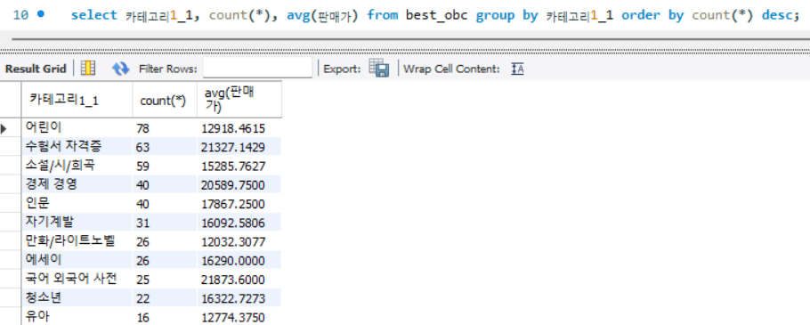

# 데이터 기술 보고서
## 1. 주제 
  * 주제 : Online Bookstore Crawling
      * 주제 선택 이유 
      독서율은 교과서, 참고서, 만화 등의 도서를 제외한 일반 도서를 1년 동안 1권 이상 읽은 사람의 비율을 나타내는 지표로,
      한국은 OECD 19개국 중 12위로 비교적 낮은 순위에 위치해 있다. 
      또, 각종 디지털 매체의 보급으로 해마다 독서율 및 독서량이 감소하는 추세이고, 독서 인구 간의 편차도 크다. 
      이에 한국인의 독서 실태를 조사하기 위해 주제를 선정했다. 
      [출처 : 문학신문 '[랭킹] OECD 국가 중 한국의 독서율은 몇 위일까?'](https://www.munhakin.kr/news/articleView.html?idxno=745)
      * 이용 계획
      
        1. 단기적 데이터 
        * 판매량이 높은 카테고리 조사
        * 책의 가격과 판매량의 상관관계 조사
        * 스테디 셀러에 오른 책들의 특징 파악
        2. 장기적 데이터 
        * 베스트 셀러에 오래 남아있는 책의 공통점 조사
        * 자주 베스트 셀러에 오르는 책을 출판하는 작가/출판사 조사
        * 책 소개에 대한 분석  
        이용 예시 : 카테고리 별 500위 안에 든 횟수와 평균 가격
       
## 2. 프로젝트 조원별 담당 업무
* 공통 : 크롤링 코드 작성 및 HTML 구조 분석
* 김문선 : csv파일 저장 및 MySQL DB와 연동 구현 
* 이서희 : 코드 개선, 문서 작성, 팀원 보조
* 이주호 : 코드 테스트-개선, 데이터 관리
## 3. 후기
개인 문서로 작성(링크)
* [김문선](후기-김문선.md)
* [이서희](후기-이서희.md)
* [이주호](후기-이주호.md)

