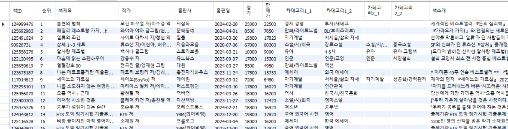

# 데이터 셋

* 크롤링한 데이터 
  .OBC/Datas 경로에 베스트셀러/월간 베스트 셀러/스테디 셀러 별로 500위까지 데이터를 수집한 시간을 파일명으로 저장
* MySQL DB 
 
테이블 구조 
  * 책ID : URL은 https://www.yes24.com/Product/Goods/ + 숫자의 형태로 반복되는데, 이는 책마다 고유하므로 * Primary Key로 활용했다. 
  * 순위 : 데이터를 수집한 날짜 기준의 순위 
  * 작가 : 작가 및 역자
  * 출판사 : 출판사 
  * 출판일 : 연-월-일 형태로 저장
  * 정가 : 원래의 가격
  * 판매가 : 온라인 구매 가격
  * 카테고리 : 책의 카테고리는 2개 이상일 때도 있었으며, 상위 2개의 카테고리만 최대 2개씩 저장했다.
  * 책소개 : 책 소개란의 텍스트를 저장
