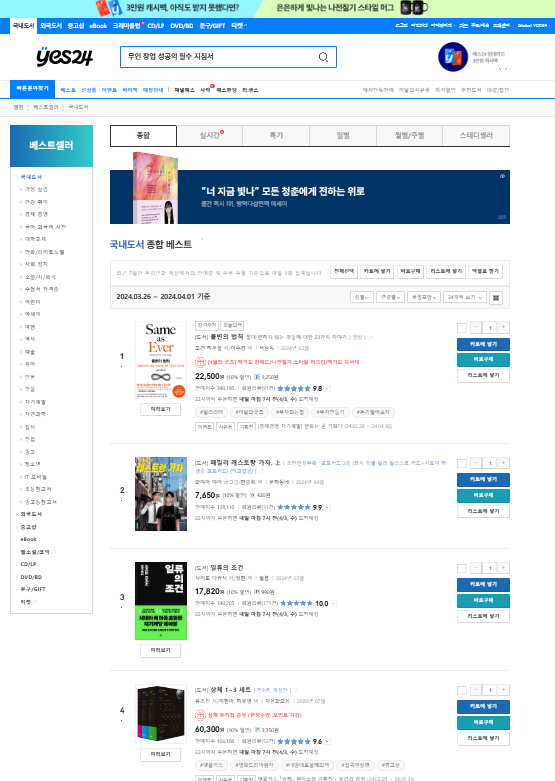
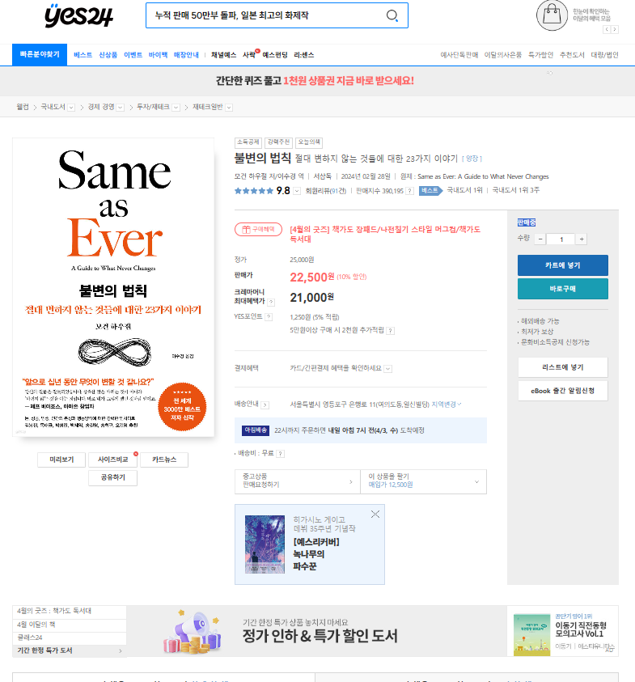
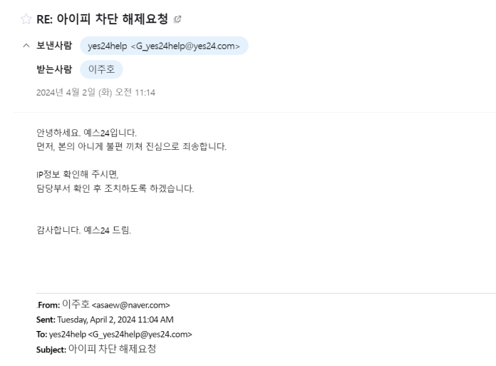

# 데이터 탐색 보고서
* 크롤링 대상 : yes24 (http://www.yes24.com)

  ## 1. 크롤링 대상 분석
   
  베스트 셀러 메인페이지. url을 바꿔 페이지당 표시 갯수 및 조회할 페이지를 조절할 수 있다. 
  책 페이지의 url과 순위 또한 html을 통해 얻을 수 있다.
* 사용한 selector (변수명)
  * 순위 셀렉터 (rank_selector) : 표지 좌측에 표기된 책의 순위를 조회
  * 표지 셀렉터 (cover_selector) : 책 표지 이미지 조회. 성인 등급의 도서는 같은 이미지를 사용하므로, 이를 체크하여 배제할 수 있다.
  * 책 셀렉터 (book_selector) : bold로 표시된 책 제목을 통해 책 제목과 해당 책 소개 페이지 url을 얻을 수 있다.
  각 책에 할당된 페이지. html를 분석해 다양한 정보를 추출할 수 있다.

   
  각 책에 할당된 페이지. html를 분석해 다양한 정보를 추출할 수 있다.

* 사용한 selector (변수명)
   * 작가/번역가 셀렉터 (auth_selector) : 작가 및 번역가를 조회할 수 있다.
   * 출판사 셀렉터 (publish_selector) : 출판사를 조회할 수 있다.
   * 출판일 셀렉터 (date_selector) : 출판일자를 조회할 수 있다.
   * 가격 셀렉터 (price_selector) : 정가/판매가를 조회할 수 있다.
   * 카테고리 셀렉터 (category_selector) : 국내도서 > 경제/경영 > 투자 재태크 와 같은 형태로 페이지에 소개된 책의 카테고리를 조회할 수 있다.
   * 책 소개 셀렉터 (introduce_selector) : 책 소개가 쓰여있는 위치를 조회할 수 있다.
  ## 2 사용 라이브러리 및 DB
  * requests : 원하는 페이지에 접근 하기 위해 사용함
  * BeautifulSoup : html 문서로부터 데이터를 얻기 위해 사용함
  * asynciom, aiohttp : 코루틴을 이용한 비동기처리로 작업시간을 줄이기 위해 사용함
  * pandas : 수집한 데이터를 DataFrame에 저장하기 위해 사용함
  * datetime, os : DataFrame을 csv파일로 저장하기 위해 사용함
  * time : 작업에 걸린 시간 측정
  * MySQL : 데이터를 저장할 DB
  * sqlalchemy : DataFrame을 MySQL DB에 저장하기 위해 사용

  ## 3. 어려웠던 점
  * 셀렉터로 얻을 수 있는 정보가 예상했던 것 보다 더 다양한 형태로, 크롤링 테스트 중 오류가 계속 반복했고 이에 맞춰 코드를 수정했다. 
  
  * 성인 등급 도서 조회를 위한 성인 인증 문제. 로그인이 필요했는데, 해당하는 대상 수가 적고 selenium을 사용하지 않는 방식으로 코드를 작성했기에 이를 수집 대상에서 제외해 해결했다. 
  
  * 크롤링 테스트 중 페이지 차단. 짧은 시간 내에 반복적으로 사이트에 접속해 yes24로부터 IP 밴을 당했다. yes24 고객문의 메일로 문의를 보내 해결했으나, 다음부터는 sleep(), random()과 같은 함수를 이용해 접속 시간을 랜덤으로 지연시켜 차단당하지 않도록 해야할 것이다. 
  
  
  
